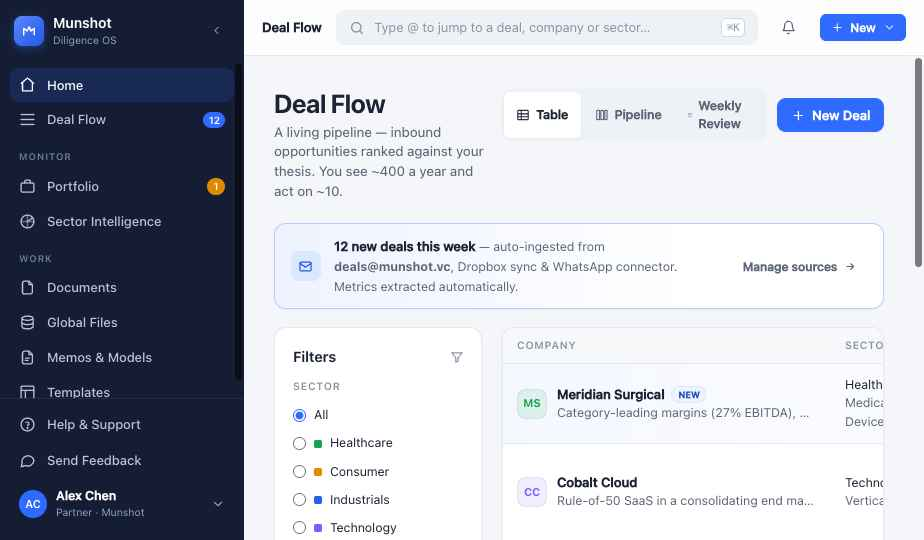

# Munshot — Diligence & Intelligence OS

A high-fidelity, interactive prototype of a private-equity **diligence and intelligence operating system**. Munshot takes a firm from raw inbound deal flow all the way to an investment-committee memo — with every extracted figure traceable back to its source document.

> Built as a **zero-build** React application: open it in a browser and it runs. No bundler, no `npm install`, no toolchain.



---

## What it does

Munshot models the full lifecycle of a PE deal team:

| Area | Highlights |
| --- | --- |
| **Home** | Pipeline / portfolio / sector snapshot, recent deals with expandable AI theses, and a live activity feed. |
| **Deal Flow** | A living pipeline of inbound opportunities ranked against your thesis, with **Table**, **Pipeline (Kanban)**, and **Weekly Review** triage modes. Sector / fit / status filters. |
| **Deal Workspace** | A per-deal tear sheet — financial statements, key people, valuation, and an inline **Explore** copilot for deep-dive Q&A. |
| **Portfolio** | Monitor held companies: MOIC, growth, covenant headroom, MIS time series, and a founder-interaction timeline. |
| **Sector Intelligence** | Signal briefings, patent-cliff and drug-launch trackers, sentiment trends, and connected research sources. |
| **Documents** | Deal files, a natural-language **query builder**, key-clause extraction, and ingestion-source management. |
| **Global Files** | A firm-wide, thematic shared library (ILPA templates, comps, benchmarks, knowledge graphs). |
| **Memos & Models** | Generate IC memos, build operating models, comps, and velocity analyses. |
| **Explore** | A traceable research copilot with quant mode, scoped sources, and per-answer citations. |

### The differentiator: provenance everywhere

Every figure carries a **confidence dot** and links back to a **sourced quote**. Hover any value to view its source documents, override it with a manual value (marked analyst-confirmed), re-run AI extraction, or report a data issue — with an inline PDF viewer that highlights the cited passage. A human can always override.

---

## Run it

The app loads its views over HTTP (the browser fetches each `*.jsx` for in-browser compilation), so it must be **served** — opening `index.html` from the filesystem won't work. Any static server does:

```bash
# Python (no install)
python3 -m http.server 8000

# or Node
npx serve .
```

Then open <http://localhost:8000>.

> Requires outbound access to `unpkg.com`, from which React 18 and Babel Standalone are loaded via CDN.

---

## Architecture

A deliberately **buildless** single-page app. `index.html` pulls in React 18 + Babel Standalone from a CDN, then loads each source file as a classic `<script type="text/babel">` tag. Because classic scripts share one global lexical scope, files reference each other's top-level components directly, and each view registers itself on `window.*` for the router in `app.jsx`.

```
index.html          App shell, font + CDN loading, script order
styles.css          Design system: tokens, components, layout (~560 lines)
data.js             Mock domain data → window.DB (deals, portfolio, sectors, sources…)
exploredata.js      Explore sessions, global-files tree, quant sample → augments window.DB

icons.jsx           Feather-style stroke icon set → window.Icon
components.jsx      Shared primitives: Menu, Modal, Drawer, charts, Prov, StatusPill…
provenance.jsx      Source modal + inline highlighted PDF viewer
commandpalette.jsx  ⌘K command palette

home.jsx            Home dashboard
dealflow.jsx        Deal Flow (table / kanban / weekly review)
workspace.jsx       Deal workspace + tear sheet
dealmodals.jsx      New-deal wizard, create/manage section modals
portfolio.jsx       Portfolio list + company monitor
sector.jsx          Sector intelligence list + detail
documents.jsx       Files, query builder, key clauses, ingestion
memos.jsx           Memos, models, comps, velocity
explore.jsx         Explore copilot + file-filters drawer
globalfiles.jsx     Firm-wide shared file library
editsection.jsx     Section configuration editor
app.jsx             Router, sidebar, top bar, overlays, toasts → mounts <App/>
```

### Design system

A single source of truth in `styles.css`: a cool-warm gray neutral ramp, a blue interactive accent, semantic status colors, tabular-figure numerics, soft elevation shadows, and motion via shared easing curves. Inter for text, JetBrains Mono for figures.

### Keyboard shortcuts

| Shortcut | Action |
| --- | --- |
| `⌘K` / `Ctrl-K` | Open the command palette |
| `⌘N` / `Ctrl-N` | New deal |
| `Esc` | Close any modal / drawer |

---

## Deploy (Cloudflare Pages / Netlify / any static host)

The app is buildless, but `npm run build` is provided for hosts that expect a
build step — it copies the static assets into `dist/`. A `wrangler.toml` pins
the Pages output directory to `dist`.

| Setting | Value |
| --- | --- |
| Build command | `npm run build` |
| Build output directory | `dist` (set via `wrangler.toml`) |

> If a deploy fails with `ENOENT … package.json`, the host is building an old
> commit from before this config was added — deploy the latest commit on
> `main` rather than retrying the old build. With **no** build step you can
> instead leave the build command empty and publish from the repo root.

## Notes

- All data is **mock** and lives in `data.js` / `exploredata.js`; nothing leaves the browser.
- The UI is fully responsive — the right rail collapses under 1100px and the sidebar becomes a drawer under 760px.
